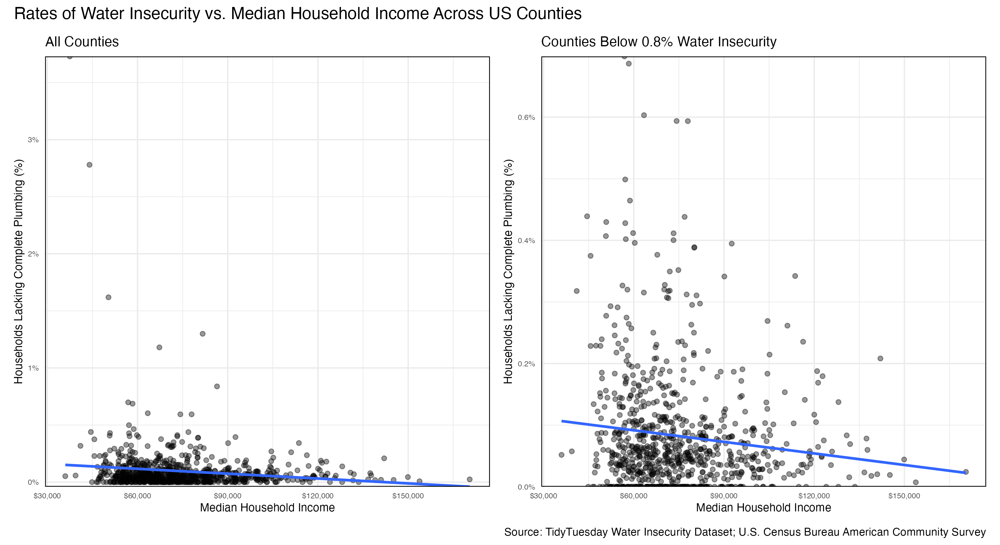
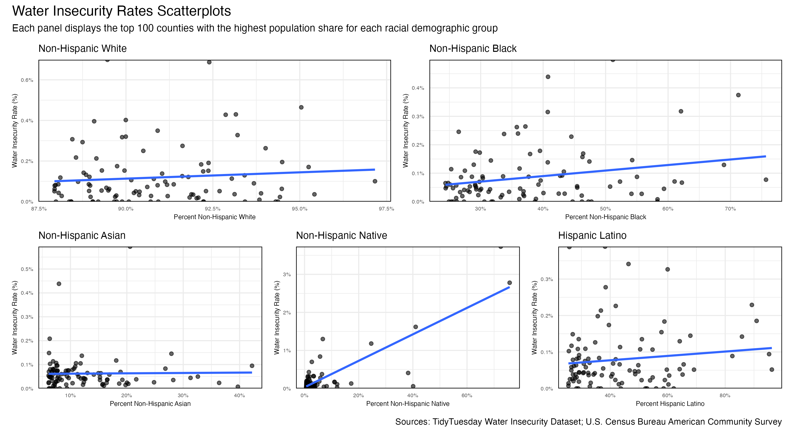
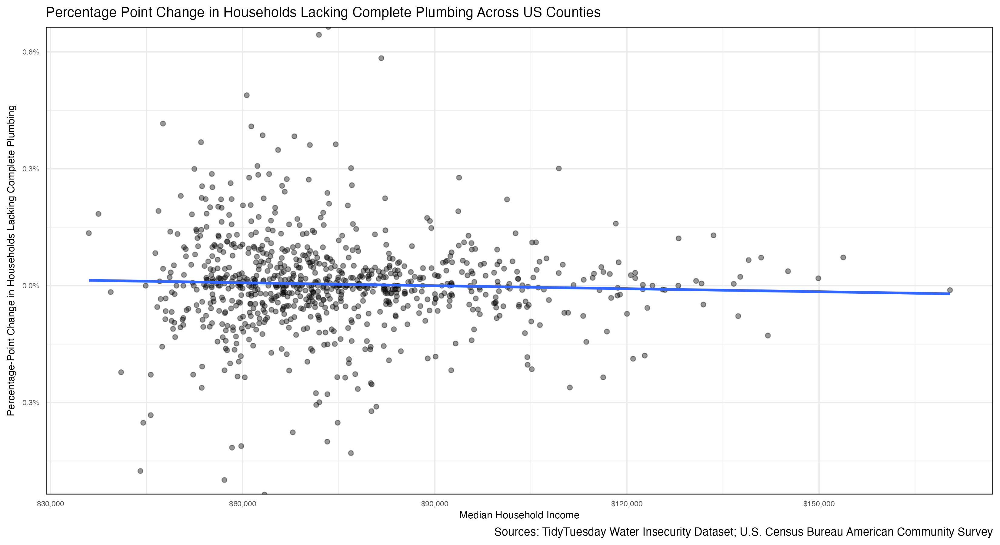
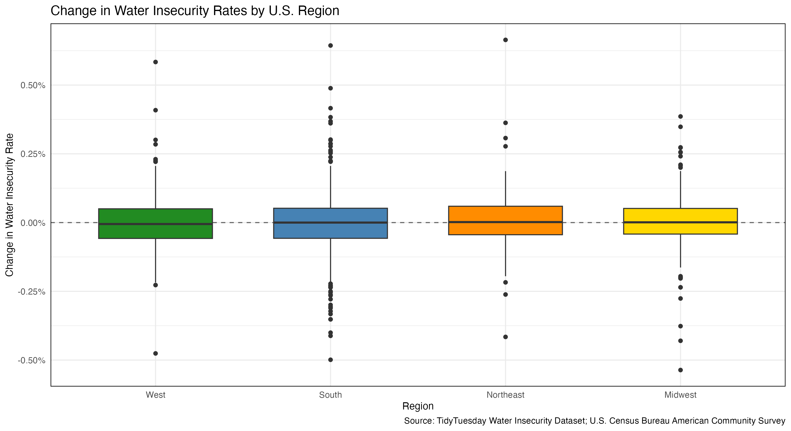
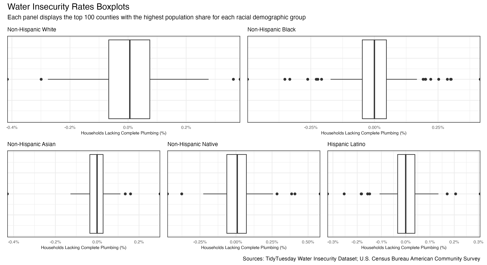

```{r}
#| label: load-packages
#| include: false

# Load packages here
pacman::p_load(tidymodels,
               tidyverse)

```

```{r}
#| label: setup
#| include: false

# Plot theme
ggplot2::theme_set(ggplot2::theme_minimal(base_size = 11))

# For better figure resolution
knitr::opts_chunk$set(
  fig.retina = 3, 
  dpi = 300, 
  fig.width = 6, 
  fig.asp = 0.618 
  )
```

```{r}
#| label: load-data
#| include: false
# Load data here
```

## Introduction and Data Overview {.smaller}

- Working with 2022 and 2023 U.S. county-level water insecurity data from TidyTuesday.

- Defining "water insecurity" as a household lacking full plumbing.

- Added additional demographic, regional, and economic variables from the U.S. Census Bureau.

- Selected this data due to personal interest in water access and local problems involving water availability in my home state of California.

**Question 1:** What demographic and economic characteristics are associated with higher and lower rates of water insecurity?

**Question 2:** Which characteristics, either demographic, economic, or regional, are associated with changes in the rate of water insecurity from 2022 to 2023?

## Question 1: Median Household Income and Water Insecurity {style="font-size: 0.75em;"}

```{r}
#| echo: false
#| out-width: "90%"
#| fig-align: "center"


```

## Question 1: Racial Demographic Groups and Water Insecurity {style="font-size: 0.75em;"}

```{r}
#| echo: false
#| out-width: "90%"
#| fig-align: "center"


```

## Question 2: Median Household Income and Changes in Water Insecurity Rates {style="font-size: 0.75em;"}

```{r}
#| echo: false
#| out-width: "90%"
#| fig-align: "center"


```

## Question 2: Region and Changes in Water Insecurity Rates {style="font-size: 0.75em;"}

```{r}
#| echo: false
#| out-width: "90%"
#| fig-align: "center"


```

## Question 2: Racial Demographic Groups and Changes in Water Insecurity Rates {style="font-size: 0.75em;"}

```{r}
#| echo: false
#| out-width: "90%"
#| fig-align: "center"


```

## Conclusions and Limitations  {.smaller}

- Counties with high concentrations of specific racial demographics such as non-Hispanic Native Americans appear associated with higher levels of water insecurity.

- Median Household Income seems negatively associated with rates of water insecurity.

  - High degree of variation makes these observations somewhat uncertain.

- No discernible relationships between the percentage-point change in rates of water insecurity and regional and demographic variables.

- Potentially some association between median household income and the percentage-point change in rates of water insecurity.

- Limitations to consider:

  - All observational data rather than causal.

  - Small population shares for certain racial demographics.

  - likely missing actual explanatory variables (rurality, geology, infrastructure, etc.)
